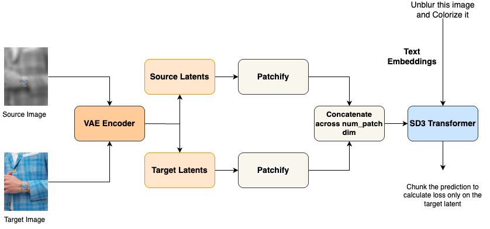

# SD3_Kontext
This repository contains the code for training SD3 for image editing task. 

#Training Flow

#Details 
# Stable Diffusion 3.5 – Image Editing Training (FluxContext-Inspired)

## 📌 Project Overview
This project modifies **Stable Diffusion 3.5** to support **in-context image editing**, inspired by **FLUX.1 Kontext**’s ability to understand both a target and a conditional image, enabling precise edits while preserving consistency across iterations.

---

## 🚀 Training Approach

1. **Dual-Image Input**
   - Each training step takes **two images**:
     - **Conditional image** – provides the context or source.
     - **Target image** – the image to be predicted/edited.
   - Both are **patchified** into embeddings.
   - Embeddings are **concatenated** and enriched with **positional embeddings**.

2. **Transformer Processing**
   - The combined sequence is passed into the transformer.
   - The model's prediction is chunked 

3. **Loss Computation**
   - Loss is computed **only on target image predictions**.
   - Conditional image guides the model but does not contribute directly to loss.

---

## 🔍 How It Compares to FLUX.1 Kontext
- **FLUX.1 Kontext** concatenates tokens from both input and output images for diffusion-based **in-context generation/editing**.
- Enables:
  - **Multi-turn editing workflows** (iterative refinements).
  - **Character & scene consistency** over multiple edits.
  - Strong performance for **complex contextual edits**.
